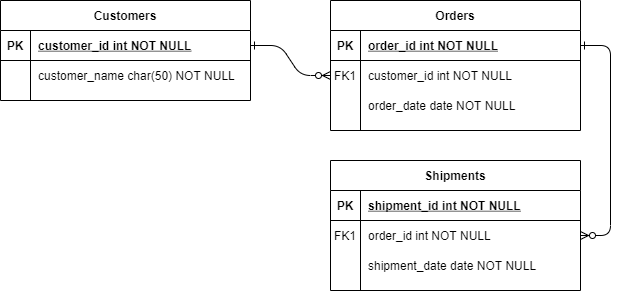

# MarketplaceReturn

## Overview

`VirtoCommerce.MarketplaceReturn` gives marketplace sellers a way to manage returns on their
own orders inside **vendor-portal**. The return domain model and CRUD (`Return`,
`ReturnLineItem`, `IReturnService`, `IReturnSearchService`, `api/return/*`) live entirely in the
sibling module [`vc-module-return`](https://github.com/VirtoCommerce/vc-module-return) and are
not duplicated here.

This module adds two things on top of that:

- **A seller-scoping backend interlayer** (`SellerReturn`), so sellers only ever see and edit
  returns for their own orders. `SellerReturn` does **not** inherit from `Return` - it holds a
  `Return` by composition, in its own table, mapped 1:1 by `ReturnId`. It was originally built as
  a table-per-hierarchy extension of the shared `Return` table, which broke the base Return
  module's own endpoints (an ungenerated `Discriminator` column); composition avoids touching the
  base module's schema at all.
- **A vc-shell (Vue 3 / module-federation) frontend**, shipped as a `vendor-portal` remote
  module (see `VirtoCommerce.MarketplaceReturn.Web/vcmp-return`), not a standalone app -
  vendor-portal owns authentication/session.

Deployment scenario: install this module alongside `VirtoCommerce.Return` and
`VirtoCommerce.MarketplaceVendor` on a marketplace platform instance that runs vendor-portal, so
sellers can self-serve return handling without operator involvement.

## Dependencies

- `VirtoCommerce.Return` - owns the `Return`/`ReturnLineItem` domain model and CRUD.
- `VirtoCommerce.MarketplaceVendor` - seller/vendor-portal infrastructure (`SellerAuthorizationHandler`,
  seller resolution for operators impersonating a seller via vendor-portal's `/:sellerId` route).

## Functional Requirements

- Sellers can list, view, create and update returns for their own orders. **Delete is
  intentionally not exposed in the frontend.**
- An operator viewing vendor-portal "as" a seller (via the `/:sellerId` route) gets the same
  scoping as a real seller login.
- A return's line item quantity can never be edited past what's left available to return on the
  underlying order line item.

## Scenarios

- **Main menu → Returns**: a list blade (`marketplace-return:access`) filtered to the current
  seller, with a detail blade for view/create/update, gated by
  `marketplace-return:{create,read,update}`.
- **Order Details widget**: a compact widget registered on vendor-portal's `OrderDetails` blade
  (via `registerExternalWidget`) that opens the same Returns list, pre-filtered to that order, so
  a seller can see every return raised against it (there can be more than one, e.g. when an order
  is split across sellers) and create a new one without picking the order again.
- **Split orders**: when a return is raised against a parent order that has been split into
  per-seller child orders, `IReturnSplitter`/`SellerReturnSplitter` divides the return's line
  items across new per-child-order returns, each with its own `SellerReturn` mapping.

## Web API

Swagger docs are served per-module at `/docs/{moduleId}/swagger.json`. The module id is


## Database Model



> The diagram may need regenerating to reflect the current schema: this module adds its own
> `SellerReturn` table (`ReturnId` unique FK-by-value to `Return.Id`, `SellerId`, `SellerName`,
> `ParentReturnId` for split returns) - it does not add any columns to the base `Return`/
> `ReturnLineItem` tables.

## Frontend

`VirtoCommerce.MarketplaceReturn.Web/vcmp-return` is a vc-shell sub-app built as a module-federation
remote for vendor-portal (`appId: "vendor-portal"`), not the legacy `<frontendModules>`
convention some sibling modules still reference. It builds to
`VirtoCommerce.MarketplaceReturn.Web/plugins/vendor-portal/`, which the platform discovers by
filesystem convention at `{ModuleRoot}/plugins/{appId}/remoteEntry.js`.

To regenerate the API client after a backend contract change:

```bash
cd VirtoCommerce.MarketplaceReturn.Web/vcmp-return
yarn generate-api-client
yarn build:modules-bundle
```

## Related topics

- [vc-module-return](https://github.com/VirtoCommerce/vc-module-return)
- [vc-module-marketplace-vendor](https://github.com/VirtoCommerce/vc-module-marketplace-vendor)
- [vc-shell framework](https://github.com/VirtoCommerce/vc-shell)

## License

Copyright (c) Virto Solutions LTD.  All rights reserved.

Licensed under the Virto Commerce Open Software License (the "License"); you
may not use this file except in compliance with the License. You may
obtain a copy of the License at

<https://virtocommerce.com/open-source-license>

Unless required by applicable law or agreed to in writing, software
distributed under the License is distributed on an "AS IS" BASIS,
WITHOUT WARRANTIES OR CONDITIONS OF ANY KIND, either express or
implied.
